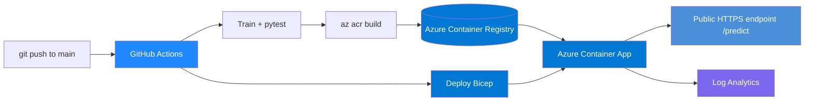

# Sentiment API on Azure Container Apps (CI/CD)

[](https://github.com/sadvi11/azure-sentiment-containerapp/actions/workflows/ci-cd.yml)


Train a machine-learning model, serve it with FastAPI, containerize it, and
ship it to **Azure Container Apps** through a **GitHub Actions CI/CD pipeline**.
Infrastructure is defined as code with **Bicep**. A serverless, multi-cloud
companion to the same model running on AWS EKS.

Interactive API docs (auto-generated by FastAPI) are available at `/docs` once
the app is running.

## Architecture



## Publish this repo to GitHub

```bash
# after unzipping
git init && git add -A && git commit -m "Initial commit: Azure Container Apps sentiment API"
git branch -M main
git remote add origin https://github.com/sadvi11/azure-sentiment-containerapp.git
git push -u origin main
```

## What It Does
- **Trains** a sentiment model (TF-IDF + Logistic Regression, scikit-learn)
- **Abstains** rather than guessing when the input is outside its vocabulary
- **Serves** it with FastAPI: `/predict`, `/health`, `/metrics`
- **Containerizes** it with a multi-stage, non-root Dockerfile
- **Builds in the cloud** with `az acr build` — no local Docker needed in CI
- **Deploys** to Azure Container Apps via **Bicep** (IaC)
- **Autoscales** on HTTP load, **scales to zero** when idle (no idle cost)
- **CI/CD**: GitHub Actions runs train → test → build → deploy on every push to main

## Tech Stack
| Layer | Tools |
|-------|-------|
| Model | scikit-learn, joblib |
| API | FastAPI, Uvicorn, Pydantic |
| Container | Docker (multi-stage, non-root) |
| Registry | Azure Container Registry (ACR) |
| Hosting | Azure Container Apps (serverless) |
| IaC | Bicep |
| CI/CD | GitHub Actions |
| Observability | Prometheus `/metrics`, Azure Log Analytics |

---

## Quick start (local, free)

```bash
make install
make train
make test
make run          # http://localhost:8000
curl -X POST http://localhost:8000/predict \
  -H "Content-Type: application/json" \
  -d '{"text":"strong growth and improving margins"}'
# -> {"label":"positive","confidence":0.927,"vocab_coverage":1.0,...}
```

---

## Deploy to Azure

You need the [Azure CLI](https://learn.microsoft.com/cli/azure/install-azure-cli)
and an Azure subscription (a free account works).

### One-time pipeline setup

The pipeline authenticates with **OIDC (workload identity federation)** — GitHub
proves its identity to Azure on each run and gets a short-lived token. **No Azure
credential is stored in GitHub at all**, so there is no long-lived secret to
leak, rotate, or accidentally print into a log.

```bash
SUB=<YOUR_SUBSCRIPTION_ID>
REPO=<your-github-user>/azure-sentiment-containerapp

# 1. Create the resource group yourself, so the pipeline's identity never
#    needs subscription-wide rights.
az group create --name sentiment-rg --location canadacentral

# 2. Register an application. Note: no client secret is ever created.
APP_ID=$(az ad app create --display-name "sentiment-cicd-oidc" --query appId -o tsv)
az ad sp create --id "$APP_ID"

# 3. Trust GitHub Actions, but only this repo's main branch.
#    NOTE: GitHub may present the subject in an *immutable* form that embeds
#    numeric owner and repo IDs, e.g.
#      repo:you@132186717/azure-sentiment-containerapp@1331104566:ref:refs/heads/main
#    rather than the documented repo:owner/name:ref:... form. If it does, the
#    credential below is rejected. See "If Azure login fails" under this block.
az ad app federated-credential create --id "$APP_ID" --parameters "{
  \"name\": \"github-main\",
  \"issuer\": \"https://token.actions.githubusercontent.com\",
  \"subject\": \"repo:${REPO}:ref:refs/heads/main\",
  \"audiences\": [\"api://AzureADTokenExchange\"]
}"

# 4. Grant Contributor on the resource group only.
az role assignment create --assignee "$APP_ID" --role Contributor \
  --scope "/subscriptions/${SUB}/resourceGroups/sentiment-rg"
```

**If Azure login fails with `AADSTS700213`** ("No matching federated identity
record found for presented assertion subject"), the error prints the exact
subject GitHub sent. Add a second credential matching it verbatim:

```bash
az ad app federated-credential create --id "$APP_ID" --parameters "{
  \"name\": \"github-main-immutable\",
  \"issuer\": \"https://token.actions.githubusercontent.com\",
  \"subject\": \"<paste the subject from the error, exactly>\",
  \"audiences\": [\"api://AzureADTokenExchange\"]
}"
```

This is not a workaround for weaker security — the ID-based subject is
*stricter*. Numeric IDs survive renames and are never reused, so trust cannot
transfer to a different repo that later takes the same name. Both credentials
can coexist; each is an accepted subject, not extra privilege.

Then in your GitHub repo → **Settings → Secrets and variables → Actions**, add
three **secrets** — `AZURE_CLIENT_ID` (the `$APP_ID` above), `AZURE_TENANT_ID`,
`AZURE_SUBSCRIPTION_ID` — and one **variable**, `ACR_NAME` (globally unique,
lowercase). These are identifiers rather than credentials; they are stored as
secrets so GitHub masks them in logs.

Push to `main` and the pipeline builds the image and deploys. The final step
prints your public URL.

> **Why the subject string matters:** whichever form it takes, it ends in
> `:ref:refs/heads/main`, so a run on any other branch — or from a fork — gets a
> token Azure will not accept. Widening it to `...:*` would let *any* branch or
> pull request deploy, including one opened by a stranger. Keep it narrow.
>
> **Scope note:** the pipeline skips resource-group creation when the group
> already exists, which is what lets step 4's narrow scope work. Letting the
> pipeline create the group would need subscription-level Contributor.

### Or deploy by hand
See [`infra/README.md`](infra/README.md) for the manual `az` commands.

> **Cost:** Container Apps scales to zero (no idle cost); ACR Basic is ~$5/mo.
> Tear down with `az group delete -n sentiment-rg --yes --no-wait`.

---

## The deployed app — currently offline

This service ran in production on Azure Container Apps in `canadacentral`,
released by pipeline on every push to `main`. **The Azure subscription backing
it has since been disabled (free-trial credits exhausted), so the endpoint is
down.** Saying so here rather than leaving a dead link is the point — a URL
advertised as live and returning nothing is worse than no URL.

The resources still exist and the deployment is fully reproducible: the
pipeline rebuilds and redeploys the whole stack from this repository with no
manual steps, which is what infrastructure as code is for. Re-enabling billing
brings it back without a code change.

### Deploying it yourself, free

[`render.yaml`](render.yaml) is a Render Blueprint that stands this up on a
free plan in about five minutes — no cloud account with a credit card, no
billing state that can switch it off:

1. Fork this repository.
2. At [dashboard.render.com](https://dashboard.render.com) → **New** →
   **Blueprint**, connect the fork. Render reads `render.yaml`.
3. **Apply.** It installs the pinned requirements, trains the model from
   `app/data.py`, and starts uvicorn on the port it assigns.

The blueprint uses Render's native Python runtime rather than the Dockerfile.
On a paid plan the Dockerfile is the better choice — it is the same artifact
CI tests — but on the free plan a Docker build adds minutes to every deploy
and every cold start for an image whose only real dependency is scikit-learn.
The Dockerfile is still what the Azure pipeline and any Kubernetes deployment
use.

Two things worth knowing:

- **The model is trained at deploy time, not committed.** `app/model.joblib` is
  gitignored on purpose, so the deployed model always matches the code that
  produced it. A committed artifact silently drifts from its training data the
  first time that data changes.
- **The free plan sleeps after 15 minutes idle**, so the first request wakes it
  and takes ~50 seconds. Every request after that is fast. That is the same
  trade as Azure Container Apps' scale-to-zero, with a longer cold start.

```bash
# Anyone can run the identical service locally in about a minute:
make install && make train && make run
curl -X POST http://localhost:8000/predict \
  -H "Content-Type: application/json" \
  -d '{"text":"losses widened and the outlook was cut"}'
# -> {"label":"negative","confidence":0.913,"vocab_coverage":0.857,...}
```

**What was measured while it was live** (see the model section below — these
are real numbers from the running service, not estimates):

| | |
|---|---|
| Warm health check | 0.28 s |
| Cold start after idle | >30 s, then sub-second — the cost of scale-to-zero |
| Financial-sentence accuracy | 6/6 after the model fix, 2/6 before it |

## About the model — and the bug that shipped

Trains on an in-repo dataset (`app/data.py`) so it builds with no external
download. Swap in a larger dataset from Azure Blob Storage, or a transformer in
`app/model.py`, and the pipeline stays the same.

**The first version of this model was quietly wrong in production, and the
pipeline could not see it.** It is documented here because the failure is more
useful than the fix.

The model was trained on 40 product-review sentences. The deployed demo is
linked from a CV that talks about financial documents, so the sentences people
typed were *"losses widened and the outlook was cut"*. Every one of those words
was out of vocabulary. TF-IDF produced a near-zero vector, logistic regression
fell back to the class prior, and the API returned a real-looking label at
0.50–0.55 confidence. **Measured against six financial sentences it got two
right** — worse than guessing. Nothing errored. CI was green the whole time.

Two distinct defects, and only measurement found either:

| | Symptom | Cause |
|---|---|---|
| **Domain mismatch** | Confident-looking labels at ~0.52 on financial text | Trained on product reviews; every financial term out of vocabulary |
| **No generalisation** | Perfect on training sentences, **0.471 cross-validated — worse than random** | Bigrams + `min_df=1` gave 1039 features for 121 samples, 863 appearing in exactly one document. Features that occur once can only memorise |

Hyperparameter tuning capped at 0.545, which is the tell that the *data* was
the problem. The fix was structural:

- **Training data is generated compositionally** — a sentiment lexicon crossed
  with sentence templates — so every sentiment word appears in many contexts
  and there is something transferable to learn.
- **Neutral nouns are shared across both classes.** An earlier attempt put
  `outlook` in the positive list; the model learned that "outlook" means good
  and classified *"losses widened and the outlook was cut"* as **positive at
  0.67** — a confident wrong answer, which is worse than an uncertain one.
  Sentiment now lives in adjectives and verbs, where it belongs.
- **The model abstains rather than guesses.** Serving measures how much of the
  input vocabulary it actually recognises and returns `"uncertain"` below 30%
  coverage or 0.55 confidence. More training data alone would not have fixed
  the original bug — the next unfamiliar domain would fail the same silent way.

### How it is honestly evaluated

Cross-validation on generated data mostly proves the model learned the
generator. So `HELDOUT_EXAMPLES` in `app/data.py` is hand-written, never
trained on, and uses the lexicon in sentence shapes the generator does not
produce. **`make train` prints both numbers** so the gap stays visible:

```
Trained on 1200 samples -> app/model.joblib
  cross-validated accuracy (generated data): 0.997  <- confirms the lexicon was learned
  held-out accuracy (24 hand-written sentences): 0.958  <- the number that matters
```

Quote the second one. The first is not a claim about the real world.

### Sample output

Real responses from the deployed service:

```console
$ curl -s -X POST $APP/predict -H 'Content-Type: application/json' \
    -d '{"text":"losses widened and the outlook was cut"}'
{"text":"losses widened and the outlook was cut","label":"negative",
 "confidence":0.913,"vocab_coverage":0.857,"known_terms":6,"total_terms":7}

$ curl -s -X POST $APP/predict -H 'Content-Type: application/json' \
    -d '{"text":"earnings surged and margins improved"}'
{"text":"earnings surged and margins improved","label":"positive",
 "confidence":0.934,"vocab_coverage":1.0,"known_terms":5,"total_terms":5}

$ curl -s -X POST $APP/predict -H 'Content-Type: application/json' \
    -d '{"text":"le chat est sur la table"}'
{"text":"le chat est sur la table","label":"uncertain","confidence":0.5012,
 "vocab_coverage":0.0,"known_terms":0,"total_terms":6,
 "reason":"only 0 of 6 terms are in the model's vocabulary (0% coverage,
  minimum 30%). This text is outside the domain the model was trained on,
  so any label would be a guess rather than a prediction."}
```

The six financial sentences that used to score 2/6 now score 6/6, and they are
[regression tests](tests/test_api.py) so that cannot silently return.

**What this costs:** the endpoint says "I don't know" more often. That is the
right trade. A wrong answer a user acts on is more expensive than a refusal.

## Project layout
```
.
├── app/            # model training, loading, and FastAPI service
├── tests/          # pytest suite (runs in CI)
├── infra/          # Bicep infrastructure as code
├── .github/        # GitHub Actions CI/CD pipeline
├── Dockerfile      # multi-stage, non-root image
└── Makefile        # make help
```

---

## For recruiters & interviews

**Resume bullets** (copy-paste ready):
- Built and deployed a containerized ML inference API (FastAPI) to **Azure
  Container Apps**, with a **GitHub Actions CI/CD** pipeline that trains, tests,
  builds in **Azure Container Registry**, and deploys on every push to `main`.
- Defined all Azure infrastructure as code with **Bicep** (Log Analytics,
  Container Apps environment, autoscaling app), reducing deployment to one command.
- Configured **HTTP autoscaling with scale-to-zero**, non-root hardened
  containers, and health probes for a production-ready, cost-efficient service.
- Delivered the **same ML workload across AWS (EKS) and Azure (Container Apps)**,
  demonstrating multi-cloud deployment and trade-off analysis.

**Interview talking points:**
- *Why Container Apps over AKS?* Serverless, scales to zero, no cluster ops —
  right tool when you don't need full Kubernetes control.
- *How does the pipeline stay secure?* Deploy via a scoped service principal;
  production upgrade path documented (managed identity + `AcrPull`).
- *How would you scale the model?* Swap the in-repo dataset for Azure Blob
  Storage or a Hugging Face transformer — the pipeline is unchanged.

**Skills demonstrated:** Azure · Container Apps · ACR · Bicep · Docker ·
CI/CD · GitHub Actions · Python · FastAPI · MLOps · IaC

## Author
Sadhvi Sharma | Cloud Engineer → AI Engineer | Nokia 5G + AWS + Azure
github.com/sadvi11
