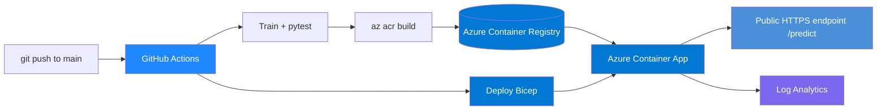

# Sentiment API on Azure Container Apps (CI/CD)

[](https://github.com/sadvi11/azure-sentiment-containerapp/actions/workflows/ci-cd.yml)


Train a machine-learning model, serve it with FastAPI, containerize it, and
ship it to **Azure Container Apps** through a **GitHub Actions CI/CD pipeline**.
Infrastructure is defined as code with **Bicep**. A serverless, multi-cloud
companion to the same model running on AWS EKS.

Interactive API docs (auto-generated by FastAPI) are available at `/docs` once
the app is running.

## Architecture



## Publish this repo to GitHub

```bash
# after unzipping
git init && git add -A && git commit -m "Initial commit: Azure Container Apps sentiment API"
git branch -M main
git remote add origin https://github.com/sadvi11/azure-sentiment-containerapp.git
git push -u origin main
```

## What It Does
- **Trains** a sentiment model (TF-IDF + Logistic Regression, scikit-learn)
- **Serves** it with FastAPI: `/predict`, `/health`, `/metrics`
- **Containerizes** it with a multi-stage, non-root Dockerfile
- **Builds in the cloud** with `az acr build` — no local Docker needed in CI
- **Deploys** to Azure Container Apps via **Bicep** (IaC)
- **Autoscales** on HTTP load, **scales to zero** when idle (no idle cost)
- **CI/CD**: GitHub Actions runs train → test → build → deploy on every push to main

## Tech Stack
| Layer | Tools |
|-------|-------|
| Model | scikit-learn, joblib |
| API | FastAPI, Uvicorn, Pydantic |
| Container | Docker (multi-stage, non-root) |
| Registry | Azure Container Registry (ACR) |
| Hosting | Azure Container Apps (serverless) |
| IaC | Bicep |
| CI/CD | GitHub Actions |
| Observability | Prometheus `/metrics`, Azure Log Analytics |

---

## Quick start (local, free)

```bash
make install
make train
make test
make run          # http://localhost:8000
curl -X POST http://localhost:8000/predict \
  -H "Content-Type: application/json" \
  -d '{"text":"this azure deployment worked perfectly"}'
# -> {"text":"...","label":"positive","confidence":0.55}
```

---

## Deploy to Azure

You need the [Azure CLI](https://learn.microsoft.com/cli/azure/install-azure-cli)
and an Azure subscription (a free account works).

### One-time pipeline setup
1. **Create a deployment credential** (service principal) and copy the JSON:
   ```bash
   az ad sp create-for-rbac --name "sentiment-cicd" --role contributor \
     --scopes /subscriptions/<YOUR_SUBSCRIPTION_ID> --sdk-auth
   ```
2. In your GitHub repo → **Settings → Secrets and variables → Actions**:
   - Add a **secret** `AZURE_CREDENTIALS` = the JSON from step 1.
   - Add a **variable** `ACR_NAME` = a globally-unique lowercase name (e.g. `sadvisentimentacr`).
3. Push to `main`. The pipeline builds the image in ACR and deploys the app.
   The final step prints your public URL.

### Or deploy by hand
See [`infra/README.md`](infra/README.md) for the manual `az` commands.

> **Cost:** Container Apps scales to zero (no idle cost); ACR Basic is ~$5/mo.
> Tear down with `az group delete -n sentiment-rg --yes --no-wait`.

---

## Try the deployed app
```bash
curl -X POST https://<your-app-url>/predict \
  -H "Content-Type: application/json" \
  -d '{"text":"great customer service and fast delivery"}'
```

## About the model
Trains on a small in-repo dataset (`app/data.py`) so it builds with no external
download — the **train → serve → deploy** pipeline is the point. Swap in a larger
dataset from Azure Blob Storage, or a Hugging Face transformer in `app/model.py`,
and the pipeline stays the same.

## Project layout
```
.
├── app/            # model training, loading, and FastAPI service
├── tests/          # pytest suite (runs in CI)
├── infra/          # Bicep infrastructure as code
├── .github/        # GitHub Actions CI/CD pipeline
├── Dockerfile      # multi-stage, non-root image
└── Makefile        # make help
```

---

## For recruiters & interviews

**Resume bullets** (copy-paste ready):
- Built and deployed a containerized ML inference API (FastAPI) to **Azure
  Container Apps**, with a **GitHub Actions CI/CD** pipeline that trains, tests,
  builds in **Azure Container Registry**, and deploys on every push to `main`.
- Defined all Azure infrastructure as code with **Bicep** (Log Analytics,
  Container Apps environment, autoscaling app), reducing deployment to one command.
- Configured **HTTP autoscaling with scale-to-zero**, non-root hardened
  containers, and health probes for a production-ready, cost-efficient service.
- Delivered the **same ML workload across AWS (EKS) and Azure (Container Apps)**,
  demonstrating multi-cloud deployment and trade-off analysis.

**Interview talking points:**
- *Why Container Apps over AKS?* Serverless, scales to zero, no cluster ops —
  right tool when you don't need full Kubernetes control.
- *How does the pipeline stay secure?* Deploy via a scoped service principal;
  production upgrade path documented (managed identity + `AcrPull`).
- *How would you scale the model?* Swap the in-repo dataset for Azure Blob
  Storage or a Hugging Face transformer — the pipeline is unchanged.

**Skills demonstrated:** Azure · Container Apps · ACR · Bicep · Docker ·
CI/CD · GitHub Actions · Python · FastAPI · MLOps · IaC

## Author
Sadhvi Sharma | Cloud Engineer → AI Engineer | Nokia 5G + AWS + Azure
github.com/sadvi11
